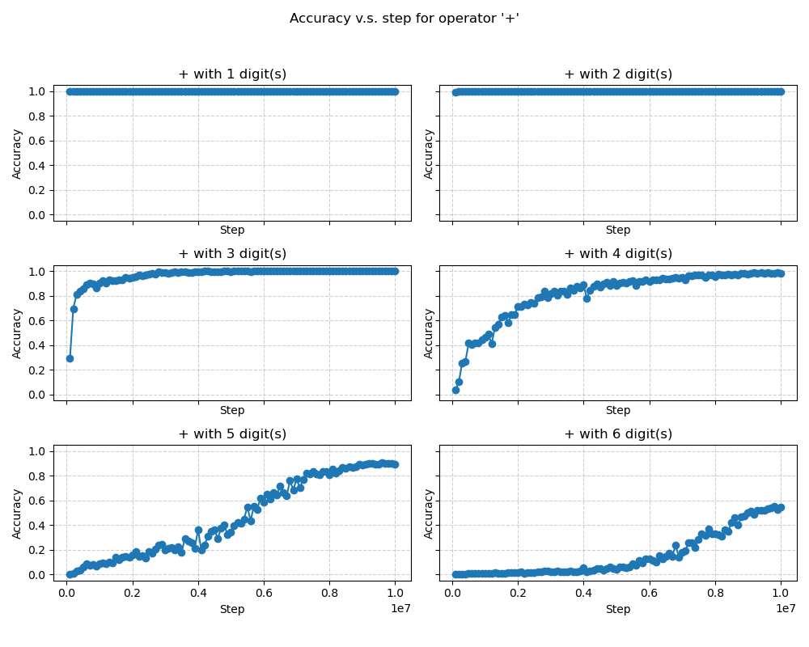
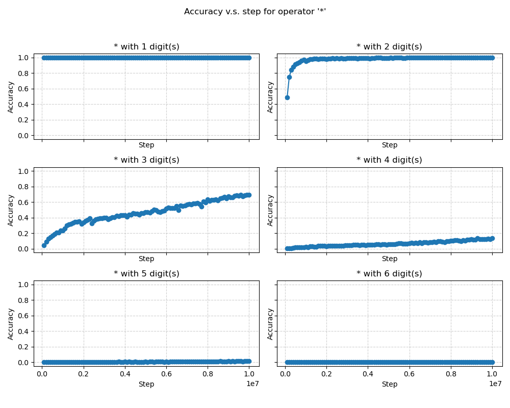

## Numerical Language Model (NLM)

A transformer-based numerical language model on reverse-Polish Notation arithmetic

### Layout
- **`train.py`**: trains the model, logging to `runs/<timestamp>/` 
- **`eval.py`**: evaluation over all checkpoints, writes `eval_log.csv`
- **`src/`**: core code (`data.py`, `model.py`, `train_utils.py`, `eval_utils.py`).
- **`plot.py`**: Plotting. 

### Results

Addition is noticeably easier relative to multiplication.

Accuracy vs. step for addition tasks:

Accuracy vs. step for multiplication tasks:

